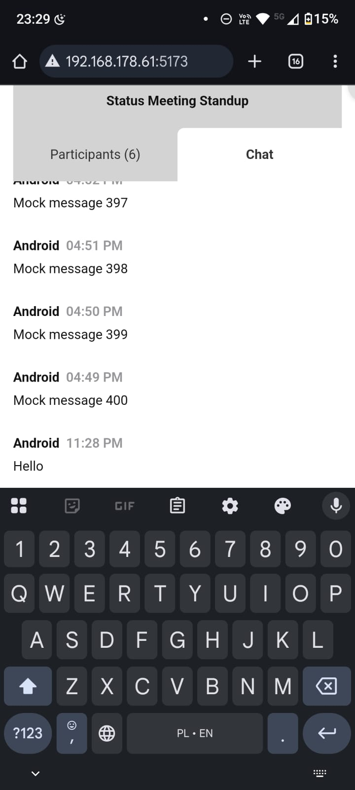
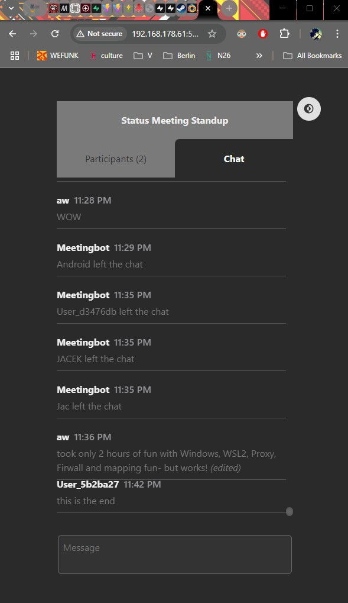

# Chat App

A real-time chat application that supports multiple connected clients with synchronized messages and participant presence tracking.

## Features, Testing & Effort

-   Real-time messaging between users using native WebSockets
-   Participant presence awareness
-   Edit and delete your own messages (with edits visible to others)
-   Efficient rendering of large datasets via react-window
-   Minimal, clean UI based on a custom mock design
-   Fully functional Redux state management
-   DarkTheme
-   Environment-based mock message generation for performance testing
-   WebSocket connection logic decoupled into middleware with reconnection retries

### Testing & Validation

-   Successfully tested on **two separate devices** (laptop and phone) within the same Wi-Fi network
-   Confirmed correct handling of **over 400 messages** for performance and UI validation
-   Extensive manual debugging and network configuration for WSL2 (Windows 11) environment
-   Development and troubleshooting spanned **15+ hours**

**Screenshots from Cross-Device Testing**

<div style="display: flex; gap: 16px; align-items: flex-start;">


</div>

## Tech Stack

### Frontend

-   React (Vite)
-   TypeScript
-   Native WebSocket API
-   Redux Toolkit

### Backend

-   Node.js (with Express)
-   WebSocket server (`ws`)
-   TypeScript

---

## Project Structure

```plaintext
chat-app/
├── backend/
├── frontend/
└── README.md
```

---

## Setup Instructions

### Prerequisites

-   Node.js (v18+ recommended)
-   npm (or yarn/pnpm)

### 1. Clone the Repository

```bash
git clone https://github.com/jacekroszkowiakdev/chat-app.git
cd chat-app
```

### 2. Setup the Backend

```bash
cd backend
npm install
npm run dev
```

> Starts the WebSocket + Express server on `http://localhost:3001`.

Ensure this line is used in `server.ts`:

```ts
server.listen(PORT, "0.0.0.0", () => {
    console.log(`Server started on port ${PORT}`);
});
```

#### Backend Environment Variables

Create a `.env` file in the `backend/` directory:

```env
PORT=3001
HOST=0.0.0.0
```

These control:

-   `PORT`: which port the backend will listen on

-   `HOST`: which network interface the server binds to (use 0.0.0.0 to allow LAN access)

### Backend File Structure

```plaintext
backend/

src
├── handlers
│   ├── message.handlers.ts
│   └── user.handlers.ts
├── server.ts
├── services
│   ├── message.service.ts
│   └── user.service.ts
├── types.ts
└── utils
    ├── colorGenerator.ts
    └── websocket.ts
```

### 3. Setup the Frontend

```bash
cd frontend
npm install
npm run dev -- --host 0.0.0.0
```

> Starts the frontend development server on `http://localhost:5173`

#### Frontend Environment Variables

Create a `.env` file in the `frontend/` directory:

```env
VITE_WS_URL=ws://192.168.178.61:3001
VITE_MOCK_MESSAGE_COUNT=400
```

These control:

-   `VITE_WS_URL`: The full WebSocket URL used by the frontend to connect to the backend
-   `VITE_MOCK_MESSAGE_COUNT`: Number of mock messages used for UI and performance testing

```bash
npm run dev -- --host 0.0.0.0
```

### Frontend File Structure

```plaintext
frontend/

── public/
src
├── App.tsx
├── assets
├── components
│   ├── Chat
│   │   ├── Chat.css
│   │   ├── Chat.tsx
│   │   ├── DisplayChat
│   │   │   ├── DisplayChat.css
│   │   │   ├── DisplayChat.tsx
│   │   │   ├── MessageComposer
│   │   │   │   ├── MessageComposer.css
│   │   │   │   └── MessageComposer.tsx
│   │   │   └── MessageItem
│   │   │       ├── MessageItem.css
│   │   │       └── MessageItem.tsx
│   │   └── DisplayParticipants
│   │       ├── DisplayParticipants.css
│   │       ├── DisplayParticipants.tsx
│   │       └── ParticipantItem
│   │           ├── ParticipantItem.css
│   │           └── ParticipantItem.tsx
│   ├── UserSetup
│   │   ├── UserSetup.css
│   │   └── UserSetup.tsx
│   └── ui
│       └── ThemeToggle
│           ├── ThemeToggle.css
│           └── ThemeToggle.tsx
├── hooks
│   ├── useDarkMode.ts
│   ├── useMessageHandlers.ts
│   ├── useMockMessages.ts
│   ├── useSendMessage.ts
│   ├── useWaitForWebSocket.ts
│   └── useWebSocket.ts
├── index.css
├── main.tsx
├── store
│   ├── actions
│   │   ├── chat.actions.ts
│   │   └── websocket.actions.ts
│   ├── middleware
│   │   └── websocket.middleware.ts
│   ├── slices
│   │   ├── chat.slice.ts
│   │   ├── theme.slice.ts
│   │   ├── user.slice.ts
│   │   └── websocket.slice.ts
│   └── store.ts
├── styles
│   └── global.css
├── types
│   └── types.ts
├── utils
│   ├── formatTime.ts
│   └── generateMockMessages.ts
└── vite-env.d.ts
```

---

## Status

-   Backend: Fully implemented
-   Frontend: Feature-complete, tested across devices, still open to enhancements

## Future Improvements

-   Username renaming functionality

-   User-to-user direct messaging (private conversations)

-   End-to-end message encryption

-   Emoji support and message reactions

-   Link previews on pasted URLs

-   Message threading or reply feature

-   Typing indicators

-   Optimized rendering and smoother animations

-   Further component refactoring for improved maintainability

-   Enhanced mobile responsiveness and accessibility

---

## Contact & Info

-   Author: Jacek Roszkowiak
-   Email: [jacekroszkowiakdev@gmail.com](mailto:jacekroszkowiakdev@gmail.com)
-   Repository: [https://github.com/jacekroszkowiakdev/chat-app/](https://github.com/jacekroszkowiakdev/chat-app/)
